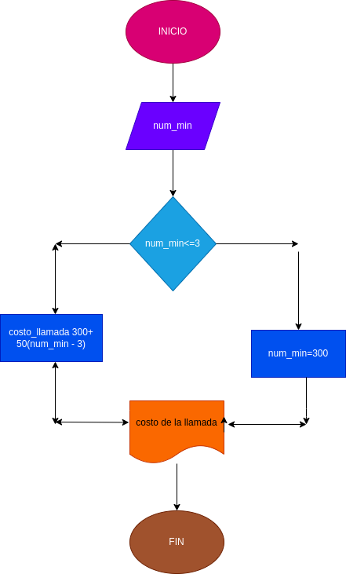

# llamada_telefonica
Ingresar el tiempo de duracion de una llamada telefonica y determinar la cantidad a pagar, de acuerdo con lo siguiente: 
- Toda llamada que dure 3min o menos tiene un costo de 300 pesos
- Cada minuto adicional cuesta 50 pesos

# Diseño 

## Diagrama de flujo 

